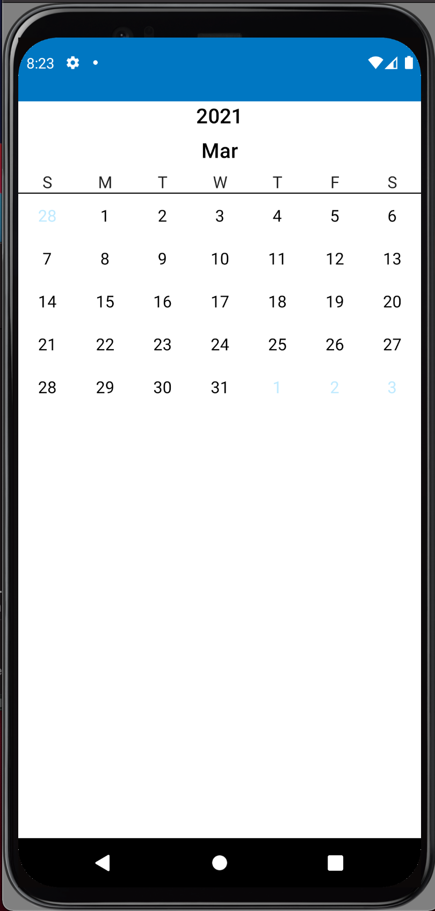
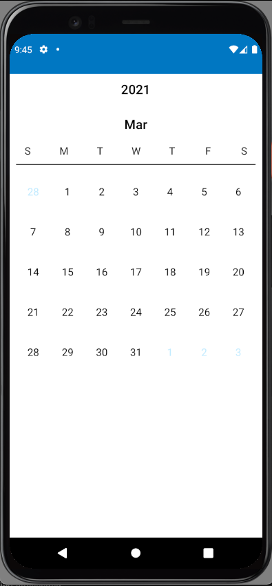
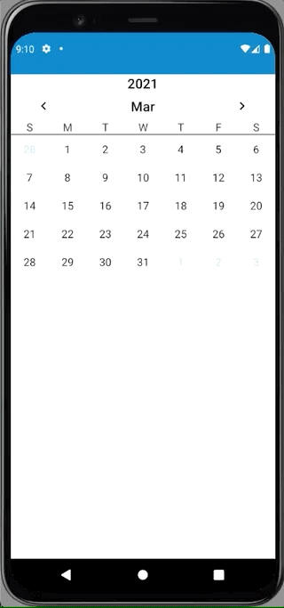
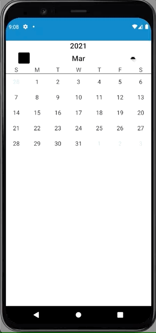
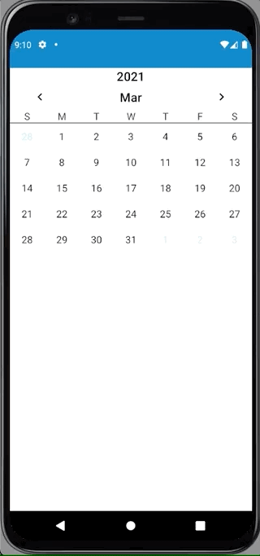

# CalendarJetpackCompose

[](https://jitpack.io/#fvalela1/CalendarJetpackCompose)

A Jetpack Compose Calendar library to easily add calendar functionality to your Android app.

<!-- TABLE OF CONTENTS -->
<details open="open">
  <summary>Table of Contents</summary>
  <ol>
    <li>
      <a href="#about-the-project">About The Project</a>
    </li>
    <li>
      <a href="#getting-started">Getting Started</a>
      <ul>
        <li><a href="#prerequisites">Prerequisites</a></li>
        <li><a href="#compatibility">Compatibility</a></li>
        <li><a href="#installation">Installation</a></li>
      </ul>
    </li>
    <li><a href="#usage">Usage</a></li>
    <li><a href="#contribute">Contribute</a></li>
    <li><a href="#license">License</a></li>
  </ol>
</details>

## Getting Started
### Prerequisites

In order to be able to use `CalendarJetpackCompose`, it requires you to configure your environment to support `Jetpack Compose`. To do so, you can follow [these steps](https://developer.android.com/jetpack/compose/setup).

### Compatibility

`CalendarJetpackCompose` only works for projects with minumum Android SDKs >= 26.

### Installation
In your project `build.gradle`, add:

```gradle
allprojects {
  repositories {
    maven { url 'https://jitpack.io' }
  }
}
```

In your module `build.gradle`, add:

```gradle
dependencies {
  implementation 'com.github.fvalela1:CalendarJetpackCompose:$version'
}
```

## Usage

**Single Month Calendar**
<table>
<tr><td> Result </td> <td> Source </td></tr>
<tr>
<td>



</td>
<td>

```kotlin
// defaults to your current year + month
CalendarJetpackCompose() 
```

</td>
</tr>
</table>

Sample: [SingleMonthCalendar.kt](https://github.com/fvalela1/CalendarJetpackCompose/blob/main/sample/src/main/java/com/fvalela/calendarjetpackcompose/sample/SingleMonthCalendar.kt)

**Default Calendar With Vertical Padding**
<table>
<tr><td> Result </td> <td> Source </td></tr>
<tr>
<td>



</td>
<td>

```kotlin
CalendarJetpackCompose(
    verticalPadding = 10.dp
)
```

</td>
</tr>
</table>

Sample: [DefaultWithIncreasedVerticalPaddingCalendar.kt](https://github.com/fvalela1/CalendarJetpackCompose/blob/main/sample/src/main/java/com/fvalela/calendarjetpackcompose/sample/DefaultWithIncreasedVerticalPaddingCalendar.kt)

**Default Calendar With Month Navigation**
<table>
<tr><td> Result </td> <td> Source </td></tr>
<tr>
<td>



</td>
<td>

```kotlin
CalendarJetpackCompose(
    // true if month nav arrows are visible or not
    canNavigateMonths = true, 
    // function that triggers when a month nav arrow is pressed
    onNavigateMonthPressed = viewModel::updateSelectedMonth, 
    year = year, // year in view
    month = month, // month in view
)
```

</td>

</tr>
</table>

Sample: [DefaultWithMonthNavigationCalendar.kt](https://github.com/fvalela1/CalendarJetpackCompose/blob/main/sample/src/main/java/com/fvalela/calendarjetpackcompose/sample/DefaultWithMonthNavigationCalendar.kt)

**Custom Month Navigation Arrows** 
<table>
<tr><td> Result </td> <td> Source </td></tr>
<tr>
<td>



</td>
<td>

```kotlin
CalendarJetpackCompose(
    year = year,
    month = month,
    onNavigateMonthPressed = viewModel::updateSelectedMonth,
    canNavigateMonths = true,
    // add your own drawables to replace the default arrows
    navigateMonthDrawableIds = 
      Pair(
        R.drawable.ic_launcher_background, 
        R.drawable.ic_launcher_foreground
      ), 
)
```

</td>

</tr>
</table>

Sample: [CustomMonthNavArrowsCalendar.kt](https://github.com/fvalela1/CalendarJetpackCompose/blob/main/sample/src/main/java/com/fvalela/calendarjetpackcompose/sample/CustomMonthNavArrowsCalendar.kt)

### Selected Dates

The library has a model - [CalendarDate.kt](https://github.com/fvalela1/CalendarJetpackCompose/blob/main/CalendarJetPackCompose/src/main/java/com/fvalela/calendarjetpackcompose/model/CalendarDate.kt) - that you can use to customize the selected dates. 
The model takes in three parameters: 
* `dateInMilli: Long` - the date in milliseconds from epoch.
* `backgroundColour: Color` - the colour of the background when selected.
* `textStyle: TextStyle?` - the style of the number (i.e. bold, font, etc...) when it is selected.

The below samples are a showcase of using either a single colour or multiple colours as backgrounds for the selected dates.

`convertSelectedDatesToCalendarDates()` can be found in any of the samples.
`updateSelectedDate(newDate: Long)` can be found in [ViewModel.kt](https://github.com/fvalela1/CalendarJetpackCompose/blob/main/sample/src/main/java/com/fvalela/calendarjetpackcompose/sample/viewmodel/CalendarViewModel.kt)


**Select Date with Background Colours**
<table>
<tr><td> Result: Single Colour </td> <td> Result: Multi Colour </td></tr>
<tr>
<td align="center">



</td>
<td align="center">
  


</td>
</tr>
<tr><td colspan="2"> Source </td></tr>
<tr>
<td colspan="2">

```kotlin
CalendarJetpackCompose(
    year = year,
    month = month,
    selectedDates = convertSelectedDatesToCalendarDates(dates = selectedDates),
    // function to trigger when a day is pressed. Param - date in milliseconds: Long
    onDayPressed = viewModel::updateSelectedDate, 
    onNavigateMonthPressed = viewModel::updateSelectedMonth,
    canNavigateMonths = true,
)
```

</td>
</tr>
</table>

Samples: 
* [SelectDateOneColourCalendar.kt](https://github.com/fvalela1/CalendarJetpackCompose/blob/main/sample/src/main/java/com/fvalela/calendarjetpackcompose/sample/SelectDateOneColourCalendar.kt)
* [SelectDateMultiColourCalendar.kt](https://github.com/fvalela1/CalendarJetpackCompose/blob/main/sample/src/main/java/com/fvalela/calendarjetpackcompose/sample/SelectDateMultiColourCalendar.kt)


## Contribute

0. Ensure your environment supports Jetpack Compose (see [Prerequisites](#prerequisites)).
1. Clone the repo
    
    **HTTPS**
    ```sh
   git clone https://github.com/fvalela1/CalendarJetpackCompose.git
   ```
   **SSH**
   ```sh
   git clone git@github.com:fvalela1/CalendarJetpackCompose.git
   ```
2. Open Android Studio and import the `CalendarJetpackCompose` project
3. Make necessary changes
4. Submit a PR
5. Eat a slice of cake because you're awesome!

## License
```
Copyright 2020 Francesco Valela

Licensed under the Apache License, Version 2.0 (the "License");
you may not use this file except in compliance with the License.
You may obtain a copy of the License at

   http://www.apache.org/licenses/LICENSE-2.0

Unless required by applicable law or agreed to in writing, software
distributed under the License is distributed on an "AS IS" BASIS,
WITHOUT WARRANTIES OR CONDITIONS OF ANY KIND, either express or implied.
See the License for the specific language governing permissions and
limitations under the License.
```
